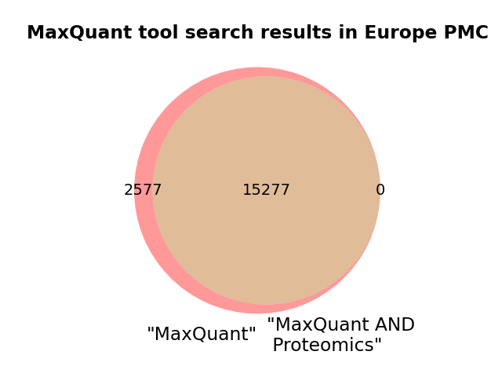

# Background

## Software mentions in the scientific literature

The mining and study of mentions of software in the scientific literature has recenntly received much attention.

Erik - would you like to expand on this background?

OpenAIRE...

The Chan Zuckerberg Initiative (CZI) has produced a software mentions dataset, CZ Software Mentions [@istrate2022largedatasetsoftwarementions], where the mentions were extracted with a trained SciBERT model from several sources: the NIH PubMed Central collection and from papers provided by various publishers to the Chan Zuckerberg Initiative.

Schindler et al. [@PMID35111920] constructed a knowledge graph from software mentions in the scientific literature, differenting different types of software, such as applications, plugins, or operating systems, and types of mention, including usage, creation and deposition. The bio.tools corpus built primarily from primary publications would be expected to cover all types of mention, including describing the creation and availability (deposition) of the tool, as well as some use cases (usage).

Software synonyms - SciCrunch

Disambiguation (if anyone looked at this?)

## bio.tools

bio.tools [@PMID31405382] is a comprehensive registry of bioinformatics tools and data services, designed to assist researchers in discovering, understanding, and utilizing software resources in the life sciences. Developed under the ELIXIR infrastructure, it serves as a centralized platform for accessing essential scientific and technical metadata about various bioinformatics tools, databases, and services. This metadata includes software licenses, operating system compatibility, repository URLs, but also semantic notation of the operation(s) performed by (or with) the software, and the data types and file format consumed and produced in the EDAM ontology [@PMID23479348].

## bio.tools and the literature

There are at least three distinct types of relationships between software tools (entries) in bio.tools and articles:

1. Articles associated with bio.tools entries in bio.tools itself, e.g. [@PMID23148064] with Comet
2. Articles citing articles associated with entries in bio.tools, e.g. [@PMID39496564] cites [@PMID23148064] associated with Comet
3. Articles mentioning tool in bio.tools, e.g. [@PMID16729052] does mention Comet (referred to as COMET), but does not cite the Comet publication (unsurprisingly, since the mentioning publication predates the tool publication).

For example, there are currently four distinct tools named "comet" with different capitalization: Comet [@PMID23148064], coMET [@PMID25928765], CoMet [@PMID21622656] and COMET [@PMID32034124]. The first is a tool used in proteomics to match tandem mass spectra to peptides. The other three are primarily used in genetics, metagenomics and epigenetics, respectivly. Since it cannot be assumed that capitalization is consistent, disambiguating homonyms such as these in the scientific literature is a non-trivial task, but necessary for accurate mining of tool mentions and extracting information on the (co-)usage of software tools. However, the software metadata and semantic annotations in bio.tools opens several possible paths to improving disambiguation. Most tools are associated with one or more topics, Comet with Proteomics, coMET with Epigenomics and Methylated DNA immunoprecipitation, CoMet with Metagenomics and Microbial ecology, and COMET with Transcription factors and regulatory sites, Gene transcripts and Epigenetics. Topics could in theory be mapped to journals. Furthermore, most tools are associated with at least one publication describing the creation, deposition and usage of the tool. These publications, or at least their titles and abstracts, could be used as reference points for the tools. If a pubication is textually more similar to the primary CoMet publication [@PMID21622656] than the primary COMET publication [@PMID32034124], mentions of "comet", ignoring capitalization, is _ceteris paribus_ more likely to be about CoMet.

To illustrate the challenges of matching Europe PMC article with bio.tools enties, we selected 3 commonly used mass-spectrometry proteomics tools with large numbers of citations in the literature: Comet[@PMID23148064], Mascot[@PMID10612281] and MaxQuant[@PMID19029910]. Figure X illustrates the number of IDs (pmids) identified for the search terms indicated and the overlap between the sets of IDs retrieved.

[Need to reformat / resize these images. Also may not want all of them?] At least Comet, and maybe at least one other, more complex, example?

As expected, we find many mentions of "comet" and "mascot" not referring to the software for peptide-spectrum matching. We also find instances of software being cited but not mentioned, e.g. the Comet paper is cited in [@PMID30702898] in a sentence "Application of these PSM algorithms (e.g., SEQUEST, X!Tandem)[@PMID24226387][@PMID23148064][@PMID14558131] have been successfully applied to metaproteomic analyses, despite the fact that they were never designed to deal with the complexity of metaproteomic data sets". Searching the name of the software together with some EDAM Topics, such as "Proteomics" helps find specific mentions with or without citation. If searching all literature, a large fraction of the mention-without-citation cases derive from non-open access papers, where the search is limited to titles and abstracts, but all citations are available.

### Subsection level 3

Please keep sections to a maximum of three levels.

## Tables, figures and so on

Please remember to introduce tables (see Table 1) before they appear on the document. We recommend to center tables, formulas and figure but not the corresponding captions. Feel free to modify the table style as it better suits to your data.

Table 1
| Header 1 | Header 2 |
| -------- | -------- |
| item 1 | item 2 |
| item 3 | item 4 |

Remember to introduce figures (see Figure 1) before they appear on the document. 

 
Figure 1. A figure corresponding to the logo of our BioHackrXiv preprint.

# Other main section on your manuscript level 1

Feel free to use numbered lists or bullet points as you need.
* Item 1
* Item 2

# Discussion and/or Conclusion

We recommend to include some discussion or conclusion about your work. Feel free to modify the section title as it fits better to your manuscript.

# Future work

And maybe you want to add a sentence or two on how you plan to continue. Please keep reading to learn about citations and references.

For citations of references, we prefer the use of parenthesis, last name and year. If you use a citation manager, Elsevier – Harvard or American Psychological Association (APA) will work. If you are referencing web pages, software or so, please do so in the same way. Whenever possible, add authors and year. We have included a couple of citations along this document for you to get the idea. Please remember to always add DOI whenever available, if not possible, please provide alternative URLs. You will end up with an alphabetical order list by authors’ last name.

# Jupyter notebooks, GitHub repositories and data repositories

* Please add a list here
* Make sure you let us know which of these correspond to Jupyter notebooks. Although not supported yet, we plan to add features for them
* And remember, software and data need a license for them to be used by others, no license means no clear rules so nobody could legally use a non-licensed research object, whatever that object is

# Acknowledgements
Please always remember to acknowledge the BioHackathon, CodeFest, VoCamp, Sprint or similar where this work was (partially) developed.

# References

Leave thise section blank, create a paper.bib with all your references.
