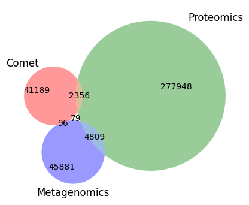
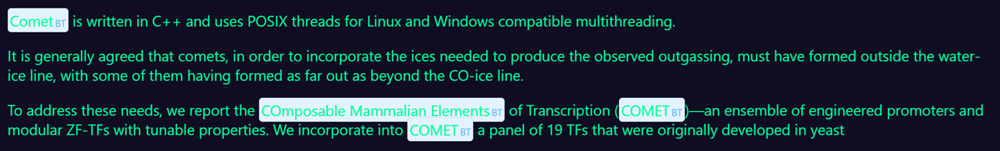

# Background

## Software mentions in the scientific literature

The mining and study of mentions of software in the scientific literature has recently received much attention. While specialized tools leveraging machine learning and deep-learning models exist, human curation of algorithmic outputs remains often unavoidable. There is still room for improvement in these models to ideally reduce the manual effort required for refining results. Integrating state-of-the-art NLP/NER tools into the curators' workflow is one approach to addressing this challenge. However, it is important to recognize the limitations of such tools and not overlook the necessity of manual work, which can be demanding. Apicuron [PMID338821209] is an initiative aimed at acknowledging biocurators who handle information extracted from publications by verifying, standardizing, and integrating it into dedicated databases. The initiative seeks to keep biocurators motivated and promote their visibility.

There exists number of approaches to tackling the problem of software mentions in the scientific literature. The Chan Zuckerberg Initiative (CZI) has produced a software mentions dataset, CZ Software Mentions [@istrate2022largedatasetsoftwarementions], where the mentions were extracted with a trained SciBERT model from several sources: the NIH PubMed Central collection and from papers provided by various publishers to the Chan Zuckerberg Initiative.

Schindler et al. [@PMID35111920] constructed a knowledge graph from software mentions in the scientific literature, differenting different types of software, such as applications, plugins, or operating systems, and types of mention, including usage, creation and deposition. The bio.tools corpus built primarily from primary publications would be expected to cover all types of mention, including describing the creation and availability (deposition) of the tool, as well as some use cases (usage).

OpenEBench is providing technical and scientific benchmarks to assess software usage and popularity. However, like other approaches, it mostly bases on citations and thus might underestimate the impact of a software tool.

Even larger efforts, such as the domain-agnostic OpenAIRE project [@REF] maintains a knowledge graph of research outcomes, including metadata records about research publications and software.

[SciCrunch](https://www.scicrunch.com/) is a collaboratively edited knowledge base of scientific resources, designed to serve as a common data source for the research community. It provides information on Research Resource Identifiers (RRIDs), which can be used in scientific publications. SciScore is an automated tool developed to assist expert reviewers by identifying and extracting structured information scattered across a paper. Additionally, SciScore verifies the presence and accuracy of RRIDs in manuscripts, detects sentences that may be missing RRIDs, and, in some cases, can even suggest appropriate RRIDs. 

Disambiguation (if anyone looked at this?)

## Europe PMC

Europe PMC is a comprehensive, freely accessible database for the life sciences literature, including research articles, reviews, preprints and patents. It provides access full-text (open access) articles, publication metadata, and papers citing or cited by a given article. Citations in Europe PMC are categorized in the broad categories of being supportive, mentioning or contrastive. Entries in nucleotide (EGA, ENA, RefSeq), protein (UniProt, IntAct, PRIDE), and research resource (RRID) databases can be searched and retrieved. Individual text-mined genes, proteins, organisms and chemicals can be displayed and visualized for a subset of open access articles.

In addition to its web interface, the Europe PMC Articles and Annotations RESTful APIs and provide programmatic access to all of this information, enabling automatation and sharing of bibliometric workflows [@PMID27122644] integrating search, metadata retrieval and analysis. This makes Europe PMC a powerful platform for exploration and mining of the scientific literature and its connection to broader scientific data.

## bio.tools

bio.tools [@PMID31405382] is a comprehensive registry of bioinformatics tools and data services, designed to assist researchers in discovering, understanding, and utilizing software resources in the life sciences. Developed under the ELIXIR infrastructure, it serves as a centralized platform for accessing essential scientific and technical metadata about various bioinformatics tools, databases, and services. This metadata includes software licenses, operating system compatibility, repository URLs, but also semantic notation of the operation(s) performed by (or with) the software, and the data types and file format consumed and produced in the EDAM ontology [@PMID23479348].

In this BioHackathon, we aimed to integrate Europe PMC and bio.tools by building tooling for exploring mentions, co-mentions and co-citations in the literature, training and refining machine learning model to recognize software mentions using the semantic software annotations in bio.tools.

# Results

## General Aspects

There are at least three distinct types of relationships between software tools (entries) in bio.tools and articles:

1. Articles associated with bio.tools entries in bio.tools itself, e.g. [@PMID23148064] with Comet
2. Articles citing articles associated with entries in bio.tools, e.g. [@PMID39496564] cites [@PMID23148064] associated with Comet
3. Articles mentioning tool in bio.tools, e.g. [@PMID16729052] does mention Comet (referred to as COMET), but does not cite the Comet publication (unsurprisingly, since the mentioning publication predates the tool publication).

For example, there are currently four distinct tools named "comet" with different capitalization: Comet [@PMID23148064], coMET [@PMID25928765], CoMet [@PMID21622656] and COMET [@PMID32034124]. The first is a tool used in proteomics to match tandem mass spectra to peptides. The other three are primarily used in genetics, metagenomics and epigenetics, respectivly. Since it cannot be assumed that capitalization is consistent, disambiguating homonyms such as these in the scientific literature is a non-trivial task, but necessary for accurate mining of tool mentions and extracting information on the (co-)usage of software tools. However, the software metadata and semantic annotations in bio.tools opens several possible paths to improving disambiguation. Most tools are associated with one or more topics, Comet with Proteomics, coMET with Epigenomics and Methylated DNA immunoprecipitation, CoMet with Metagenomics and Microbial ecology, and COMET with Transcription factors and regulatory sites, Gene transcripts and Epigenetics. Topics could in theory be mapped to journals. Furthermore, most tools are associated with at least one publication describing the creation, deposition and usage of the tool. These publications, or at least their titles and abstracts, could be used as reference points for the tools. If a pubication is textually more similar to the primary CoMet publication [@PMID21622656] than the primary COMET publication [@PMID32034124], mentions of "comet", ignoring capitalization, is _ceteris paribus_ more likely to be about CoMet.

To illustrate the challenges of matching Europe PMC article with bio.tools enties, we selected 3 commonly used mass-spectrometry proteomics tools with large numbers of citations in the literature: MaxQuant[@PMID19029910], Comet[@PMID23148064] and Mascot[@PMID10612281]. Figures 1-3 illustrates the numbers of PubMed identifiers (IDs) retrieved for the respective search terms and their overlaps.

Software synonyms is also an issue. This is currently not addressed in bio.tools. However, SciCrunch do list synonyms for some software, e.g. "Mascot Server" being a synonym for "Mascot" (RRID:SCR_014322), Scikit-learn and scikits.learn for Sklearn (RRID:SCR_019053).

As expected, we find many mentions of "comet" and "mascot" not referring to the software for peptide-spectrum matching. We also find instances of software being cited but not mentioned, e.g. the Comet paper is cited in [@PMID30702898] in a sentence "Application of these PSM algorithms (e.g., SEQUEST, X!Tandem)[@PMID24226387][@PMID23148064][@PMID14558131] have been successfully applied to metaproteomic analyses, despite the fact that they were never designed to deal with the complexity of metaproteomic data sets". Searching the name of the software together with some EDAM Topics, such as "Proteomics" helps find specific mentions with or without citation. If searching all literature, a large fraction of the mention-without-citation cases derive from non-open access papers, where the search is limited to titles and abstracts, but all citations are available.

We used the Europe PMC API to query both for citations and mentioned software tools. For that we used the following approach:
- Take >30k software tools described in bio.tools and filter for tools with a open access publication
- Apply the following two queries to the Europe PMC API, each applied to the resulting 13k tools:
  - A: Citations of given publication of a tool
  - B: Keyword search of the entire literature corpus: `"SOFTWARE NAME" AND (EDAM_TOPIC1 OR EDAM_TOPIC2 OR ...)`

Including the EDAM topics of a software tool considerable decreased the number of unrelated publications for software names similar or equal to 
widely used words, such as "comet", "Claudio" and "FUJI", but still lead to a considerable overestimation of the number of mentioning papers in several case. This can be seen in the histogram summarizing the numbers for mentioning papers per software tool (Fig. comentions).

Figure comentions: The number of publications that mention a software tool from bio.tools, including the name and one of the given EDAM topics. The number of mentioning papers was limited to a maximum of 5000. The x-axis is shown on logarithmic scale to allow seeing a wider range.

In general, capitalizaton should not be relied upon [@GOOD REF]. Indeed, our Comet example was referred to as "COMET" by the developers themselves in the first publication mentioning it [@PMID16729052].

## Networks of co-mentions and co-citations

Building workflows that integrate various tools is an essential part of bioinformatics. Extracting knowledge from the literature about software tools used together could help identify compatible tools or explore better alternatives (e.g., if multiple tools are mentioned together in a benchmark study). This challenge can be approached by searching for software tools cited together in the same publications. However, many bioinformatics tools have become so well-known (like BLAST) that researchers often mention them without citing them [PMID23768135]. This makes it crucial to have tools that can accurately detect mentions of software tools in scientific literature.

To visualize the networks of co-cited and co-mentioned tools, we generated adjacency matrices based on the results of EUROPEPMC. For co-citation networks, for instance, we retrieved citation data for 9,453 tools by querying the citations of primary publication associated with each tool, resulting in 366,828 publications in total. We then constructed a binary matrix, where 1 indicated that a tool’s primary publication was cited in a given article. From this, we derived an adjacency matrix representing the number of articles that cited pairs of tools. The resulting symmetric matrix served as the foundation for graph generation.

Since this process resulted in a very dense matrix, we applied additional filtering to refine the data. First, we removed edges between tools with the same name, as these often represented updated versions of the same software, making such connections less relevant. Additionally, we pruned edges between tools that shared the same primary publication, as this typically indicated multiple software tools originating from the same study. Furthermore, we applied a filtering threshold based on edge weight, keeping only connections where the number of shared publications was at least 50. This reduced the number of edges by approximately three orders of magnitude, making the network more meaningful and easier to interpret.

Using the py4cytoscape library, we generated network files compatible with the Cytoscape JavaScript library. We then developed a simple app that enables users to explore relationships between different software tools. A demo of the co-citation network can be viewed here: [Co-citation network](https://alszmigiel.github.io/biohackathon2024-jscytoscape/).

## Machine Learning

Transformer architectures have fundamentally transformed the field of natural language processing by excelling in contextual word understanding, primarily through the innovative use of self-attention mechanisms. This capability allows transformers to analyze and interpret the relationships between words in a sentence, enabling them to capture nuanced meanings. Using such a model, we aim to disentangle the ambiguity of whether a software name mentioned in a sentence refers to the software or a synonymous term, based on the surrounding context.
 
We retrieved open-source publications describing bio.tools entities using the Europe PMC API. For each of the 100 unique tools, we extracted 3 tool mentions using sentence boundary detection based on punctuation-aware regex splitting. We manually annotated 3,419 sentences to identify whether they mentioned the corresponding tool (boolean True) or an unrelated synonym (boolean False). We then split the dataset into training and test sets using an 80-20 ratio via the train_test_split function from Scikit-learn. We tokenised each sentence using the NLTK wordpunct tokenizer and employed the Inside-Outside-Beginning (IOB) tagging scheme, where we assigned "B-" (beginning) or "I-" (inside) labels to each entity based on its span while assigning all non-entity tokens the "O" (outside) label. We confirmed that each "I-" tag was preceded by a matching "B-" tag. The tokenised data was then used to train a case-aware biomedical corpus-pre-trained BERT family model, Bioformer-16L, to distinguish between true and false tool mentions. For evaluation, we computed accuracy, precision, recall, and F1-score on the test set. The highest achieved F1-score was 74.4%, with an accuracy of 97.1%,  precision of 68.9% and recall of 81.0%. While the accuracy achieved is sufficient to distinguish between Comet/COMET in the context of bio.tool entries ([@PMID23148064], [@PMID32034124]) and the larger, solar system score context [@PMID28554980](see Figure 1), more work is needed in the preparation of a larger training dataset to ensure the satisfactory low number of false positives.

## A hand-crafted approach

The automated extraction of software mentions from scholarly publications has recently attracted significant attention. Several research groups have developed approaches based on Named Entity Recognition (NER) models trained on curated datasets of software mentions (Istrate et al. [@istrate2022largedatasetsoftwarementions], Schindler et al. [@PMID35111920], Lopez et al. [@10.1145/3459637.3481936]). These efforts often extend beyond simple mention extraction to include disambiguation of different textual representations of the same software and, in some cases, entity linking to external knowledge bases or software repositories. While reported F1-scores for software name extraction on their respective training/test datasets appear promising (Istrate et al.: F1 = 0.92 on Softcite; Schindler et al.: F1 = 0.88 on SOMESCI; Lopez et al.: F1 = 0.71 on Softcite), these metrics may not fully reflect performance "in the wild" on uncurated, full-text corpora.

Istrate et al. provide a more realistic assessment by manually curating the top 1,000 and top 10,000 most frequent software mentions extracted from the PMC Open Access (PMC-OA) commercial subset. They report precisions of 79.5% and 69.66%, respectively, for these curated samples, indicating a substantial drop in performance when moving beyond curated data. Further analysis by Druskat et al. [@druskat2024dontmentionitapproach] of a small random sample from the Istrate et al. dataset found that only 77% of extracted mentions were correctly identified as software. Moreover, among mentions with associated repository links, 65.4% pointed to the incorrect software. These findings from state-of-the-art models highlight the inherent difficulty of accurately and reliably extracting software mentions, a challenge compounded by the inconsistent and often ambiguous ways in which software is referenced in scientific literature. This ambiguity is further reflected in the moderate inter-annotator agreement observed even among expert curators when categorizing software mentions, a point underscored by Istrate et al.'s evaluation of their top 1,000 and 10,000 extracted mentions.

In contrast to these general-purpose software extraction approaches, our task benefits from specific constraints that potentially simplify the problem. We focus exclusively on software entities present in the bio.tools registry. This fixed vocabulary, combined with the rich metadata available in bio.tools entries (including associated publications and homepages), allows us to explore a complementary approach. Instead of relying solely on NER, we can initially investigate a "reverse" strategy: leveraging the known software names and associated information from bio.tools to perform simple string matching against the target articles. We can then iteratively improve the process using hand-crafted rules to remove false positives and resolve matching conflicts.

As an initial, simplified test, we implemented a case-sensitive string matching approach, comparing names from bio.tools directly against words within a target article. Figure 1 illustrates the results for a paragraph from publication PMC3257301 [@PMID22253597]. In this visualization, different matches are highlighted with distinct background colors and linked to their corresponding bio.tools entry. In the example, all matches are false positives. For instance, "enrichment" incorrectly matches a bio.tools entry about a Python library called "enrichment" providing two methods to perform enrichment analysis, when in the context of the article it refers to a general concept, and similarly "RNA" is erroneously linked to "A *randomized Numerical Aligner* for Accurate alignment of NGS reads" despite being used generically in the text.

Recognizing that the case-sensitive approach misses valid matches (at least one tool is missed in the previous example), we broadened our matching criteria. In addition to case-sensitive matching, we also match case-insensitively. For case-sensitive matching, we remove symbols not permitted in bio.tools names, primarily punctuation. For case-insensitive matching, we retain only alphanumeric characters and additionally remove trailing numbers, anticipating that reference numbers are often inadvertently attached to preceding words. Beyond the full tool name from bio.tools, our broadened matching criteria also includes:

* tool name with version removed (e.g. "ViRBase v3.0" -> "ViRBase")
* tool name before ": " or " - " (e.g. "DAStk - Differential ATAC-seq toolkit" -> "DAStk")
* tool name from within parentheses (e.g. "MIPS mouse functional genome database (MfunGD)" -> "MfunGD")
* tool name from outside parentheses (e.g. "ImageJ (NIH)" -> "ImageJ")
* the bio.tools ID (e.g. "mfungd")
* the bio.tools ID with underscores replaced by spaces (e.g. "human_splicing_finder" -> "human splicing finder")
* acronym constructed from uppercase letters (e.g. "Single-cell Proteomic DataBase" -> "SPDB")
* individual words from multi-word tool names, but only if they contain at least two non-lowercase characters (e.g. "CAT and BAT" -> "CAT", "BAT")

Matches based on the last two criteria (acronyms and individual words) are flagged for requiring further validation (URL or citation evidence, discussed later). Multi-word matching is enabled with a tolerance for one word compounding variation (e.g. "Single-cell", "single cell", and "singlecell" are considered equivalent in case-insensitive matching). Figure 2 shows the results after applying the full set of relaxed matching rules to the same paragraph from publication PMC3257301. While this increases recall (identifying at least one true positive missed by the case-sensitive matching), it also introduces further false positives, such as "Table" matching "TABLE", "targets" matching "TargetS", "the" matching "THEx", "or" matching "OR and DXR", and "to a" matching "TOA".

To improve precision, we implemented a series of filtering rules. We first observed that valid tool names often adhere to certain naming conventions. We define "simple names" as "lowercase", "UPPERCASE", "Capital", "UPPERCASEs", "Capital2". Multi-word names are "simple" only if all words belong to the same simple category. Matches with names not conforming to these "simple name" categories are retained, as these more complex names are less likely to be common English words. Examples of retained "not simple names" include "MixedCase" and "Number4between". However, recognizing that some non-simple names can still lead to false positives due to common usage outside of software context, we curated a manual exclusion list for frequently occurring false positives (e.g. "t-SNE", "circRNA"). We acknowledge that this manual exclusion list, while practical, introduces a degree of bias, as it is inherently limited to the most prevalent false positives encountered during development.

We might still accept a "simple name" as a true match, given information from external resources. These extra resources are:

1. Frequency (in how many articles it appears) of each word from the full-texts of OA publications present in bio.tools (around 15,000 articles, downloaded before the hackathon).
2. Citation count of each entry in bio.tools (fetched from Europe PMC).
3. A large list of English words (both American and British spellings).

A simple name is accepted if its frequency in the bio.tools article corpus (resource 1) divided by the citation count of the matched bio.tools ID (resource 2) falls below an empirically determined threshold. The rationale behind this heuristic is that a tool name with a relatively high citation count, compared to its document frequency within the bio.tools publication corpus, is more likely to refer to the intended tool entity when mentioned in a scientific publication. This heuristic was further refined by several constraints, like lowercase simple names must be at least 5 characters long, 4-character uppercase acronyms must not be present in the English wordlist (resource 3), and lowercase letter-only simple names must also not be present in the wordlist (resource 3). As these simple rules will introduce both false negatives and false positives (especially near the threshold), we further incorporated manual inclusion lists (e.g. "ggplot", "Gene Ontology") and exclusion lists (e.g. "timecourse", "GSEA") for popular simple name matches to further refine the results.

If these heuristics or the name form alone can't definitively validate a match, we seek supporting evidence from either matching publications or URLs. For publication-based evidence, if the corresponding bio.tools entry includes publication information, then we search for these publications within the target article's references, attempting to match by PMID, PMCID, or DOI. As publication IDs might be absent from the references, we also implemented title-based matching, comparing publication titles from bio.tools and the article's reference list (lowercased letters and numbers only, disregarding whitespace and punctuation). Some publications in bio.tools are excluded, for example we don't take into account a generic Bioconductor paper in publication matching to avoid spurious links, as this paper is broadly associated with many Bioconductor tools in bio.tools. In cases where publication evidence is unavailable, we search for URLs associated with the bio.tools entry (homepage or other links) within the target article text and its references. URL matching is performed loosely, requiring domain-level agreement and a match between first two path segments (common path elements like "src" or "cgi-bin" are skipped over). In addition, a lower-priority match happens if the domain matches and one path segment matches the tool name itself. Schindler et al. reviewed studies reporting that URLs accompany only 4-17% of software mentions, and formal citations appear in 16-44% of mentions. Their own analysis of PubMed Central data found that the percentage of unique software entities per article with a formal citation fluctuated considerably (depending on year, research domain, and journal rank), generally remaining below 40% (Schindler et al., Fig. 11). Thus, publication and URL matching can only serve as supporting evidence in case of doubt rather than a strict requirement to avoid excessive false negatives.

After applying the filtering, some conflicts might still remain (i.e. overlapping parts of the article are matching to different bio.tools entries). These conflicts are resolved based on a prioritized set of criteria: matches with publication evidence take highest priority, followed by URL evidence, case-sensitive matches, matches with more words, longer matches, matches to shorter bio.tools IDs, etc. For example, in the case of "Comet/coMET/CoMet/COMET", the system would first prioritize any match with supporting publication or URL evidence. If no such evidence exists, the case-sensitive match would take precedence.

In a final post-processing step, targeted removal of likely false positives is done. For instance, if the tool "SCOPE" has a formal citation in the article, then this evidence will also support matching the generic English word "scope" (appearing in the wordlist). In that case matches to "scope" will be explicitly removed in the article text. Similarly, if "ccPDB" has a homepage within the article, then occurrences of "PDB" will be supported by this evidence (as "PDB" is a constructed acronym of "ccPDB"). Thus remove matches of such constructed acronyms.

The final matching results for the example paragraph from publication PMC3257301 are depicted in Figure 3. "pfam" (https://bio.tools/pfam) is now linked to the Pfam database, a match missed by the initial case-sensitive approach. However, the matches for "GO Term Finder" (https://bio.tools/go_term_finder) and "goTermMapper" (https://bio.tools/go_term_mapper) persist as interesting, but eventually incorrect matches. While the article refers to the Candida Genome Database implementation of "GO Term Finder", the linked entry in bio.tools is about a "Generic GO Term Finder" implementation. The URL provided in the article for "GO Term Finder" appears to be incorrect (it should actually be http://www.candidagenome.org/cgi-bin/GO/goTermFinder). This wrongly placed URL points to a "GO Slim Mapper" tool, which is not present in bio.tools, and is therefore correctly unmatched by our system (although the text "GO Slim Mapper" is present in the paragraph). The "goTermMapper" match itself, while incorrect, highlights an intended feature of our approach: matching tool names within URLs. This is done because in some cases, the tool name may only appear within the URL itself, and not in the surrounding text.

Despite these iterative refinements, our hand-crafted methodology still exhibits inherent shortcomings. Biases remain towards non-simple names and tools that have formal publications. Short acronyms are harder to match, requiring publication or URL evidence, and acronyms in general pose difficulties due to their inherent ambiguity. The reliance on bio.tools entries introduces vulnerabilities to outdated information, and conversely, older articles may reference tools using outdated URLs. Misattributions to semantically related but distinct tools can occur, for instance "GO" incorrectly links to https://bio.tools/go_enrichment_tool due to that entry using a generic Gene Ontology publication. The lack of synonym support in bio.tools limits matching variations like "sklearn" to "scikit-learn". Fundamentally, the approach remains string-matching based, lacking true semantic comprehension or contextual awareness. The approach is also unaware of the tool mention span and is thus susceptible to spurious substring matches, such as matching a hypothetical bio.tools entry called "Slim Mapper" within "GO Slim Mapper".

Currently, final results are not output in a form suitable for the Europe PMC Annotations API. Instead, the program retrieves full-text XML for a given PMC ID from Europe PMC, transforms it to a simple HTML representation via XSLT, and carefully searches for and highlights the matches within the HTML to facilitate visual manual inspection of the results. This could help validate the machine learning approach, but future developments could also explore hybrid approaches that integrate insights from this hand-crafted methodology – particularly regarding bio.tools linking – as manual enhancements to machine learning-based results, or alternatively, leverage trained NER models as an additional input layer to the rule-based approach.

### Subsection level 3

Please keep sections to a maximum of three levels.

## Tables, figures and so on

Please remember to introduce tables (see Table 1) before they appear on the document. We recommend to center tables, formulas and figure but not the corresponding captions. Feel free to modify the table style as it better suits to your data.

Table 1
| Header 1 | Header 2 |
| -------- | -------- |
| item 1 | item 2 |
| item 3 | item 4 |

Remember to introduce figures (see Figure 1) before they appear on the document. 

 
Figure 1. A figure corresponding to the logo of our BioHackrXiv preprint.

# Other main section on your manuscript level 1

Feel free to use numbered lists or bullet points as you need.
* Item 1
* Item 2

# Discussion and/or Conclusion

We recommend to include some discussion or conclusion about your work. Feel free to modify the section title as it fits better to your manuscript.

# Future work

And maybe you want to add a sentence or two on how you plan to continue. Please keep reading to learn about citations and references.

For citations of references, we prefer the use of parenthesis, last name and year. If you use a citation manager, Elsevier – Harvard or American Psychological Association (APA) will work. If you are referencing web pages, software or so, please do so in the same way. Whenever possible, add authors and year. We have included a couple of citations along this document for you to get the idea. Please remember to always add DOI whenever available, if not possible, please provide alternative URLs. You will end up with an alphabetical order list by authors’ last name.

# Jupyter notebooks, GitHub repositories and data repositories

* Please add a list here
* Make sure you let us know which of these correspond to Jupyter notebooks. Although not supported yet, we plan to add features for them
* And remember, software and data need a license for them to be used by others, no license means no clear rules so nobody could legally use a non-licensed research object, whatever that object is

# Acknowledgements
Please always remember to acknowledge the BioHackathon, CodeFest, VoCamp, Sprint or similar where this work was (partially) developed.

# References

Leave thise section blank, create a paper.bib with all your references.
